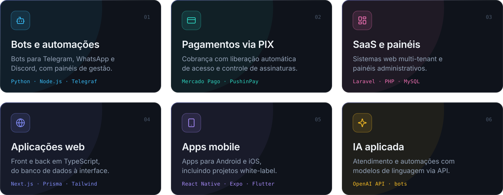

 

 

 

## Sobre mim

Sou desenvolvedor fullstack e estudante de Ciência da Computação. Gosto de construir produtos que resolvem problemas reais de ponta a ponta — da API ao app no celular do cliente.

- **No dia a dia:** bots, automações e sistemas com pagamento integrado, painéis administrativos e aplicações web e mobile.
- **Foco atual:** produtos em TypeScript com Next.js e React Native, além de backends em Laravel, Node.js e Python.
- **Pode me chamar para falar de:** bots para Telegram e WhatsApp, integrações com PIX, SaaS e automação de processos.

 

## O que eu construo

 

## Stack

<table>
  <tr>
    <td width="150"><b>Linguagens</b></td>
    <td></td>
  </tr>
  <tr>
    <td><b>Front e mobile</b></td>
    <td></td>
  </tr>
  <tr>
    <td><b>Backend</b></td>
    <td></td>
  </tr>
  <tr>
    <td><b>Dados</b></td>
    <td></td>
  </tr>
  <tr>
    <td><b>Infra e ferramentas</b></td>
    <td></td>
  </tr>
</table>

 

## Projetos em destaque

<table>
  <tr>
    <td width="50%" valign="top">
      <h3><a href="https://github.com/lipehsz05/bot-pagamentos-telegram">bot-pagamentos-telegram</a></h3>
      Bot de Telegram que recebe pagamentos via Mercado Pago, entrega produtos digitais após a confirmação e controla o acesso a grupos VIP.
        
      
      
      
    </td>
    <td width="50%" valign="top">
      <h3><a href="https://github.com/lipehsz05/bot-pagamentos-telegram-pushinpay">bot-pagamentos-telegram-pushinpay</a></h3>
      Acesso automatizado a grupos VIP do Telegram com pagamento via PIX (PushinPay), controle de assinaturas, painel de planos e SQLite.
        
      
      
      
    </td>
  </tr>
  <tr>
    <td width="50%" valign="top">
      <h3><a href="https://github.com/lipehsz05/freebothost-discloud">freebothost-discloud</a></h3>
      Hospedagem gratuita de bots do Telegram com integração à Discloud, facilitando o deploy e o gerenciamento sem custo inicial.
        
      
      
    </td>
    <td width="50%" valign="top">
      <h3><a href="https://github.com/lipehsz05/gemini-pro">gemini-pro</a></h3>
      Guia técnico sobre assinaturas do Gemini Pro, revenda de produtos digitais e integração de operações por API.
        
      
      
    </td>
  </tr>
</table>

 

## No GitHub

 
 

<picture>
  <source media="(prefers-color-scheme: dark)" srcset="https://raw.githubusercontent.com/lipehsz05/lipehsz05/output/snake-dark.svg">
  <source media="(prefers-color-scheme: light)" srcset="https://raw.githubusercontent.com/lipehsz05/lipehsz05/output/snake-light.svg">
  
</picture>

 
 

### Vamos conversar?

Aberto a colaborações, freelas e projetos interessantes. 
O jeito mais rápido de falar comigo é pelo [LinkedIn](https://www.linkedin.com/in/lipehsz) ou por [e-mail](mailto:ftsu2570@gmail.com).

 

Estatísticas e animação atualizadas automaticamente a cada 12 horas via GitHub Actions.

